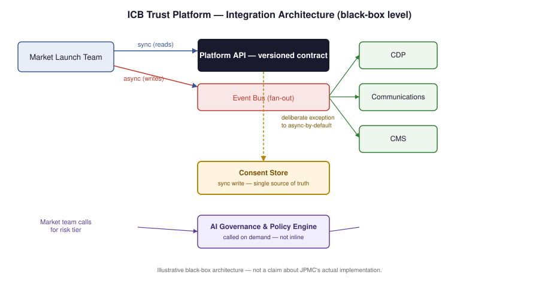
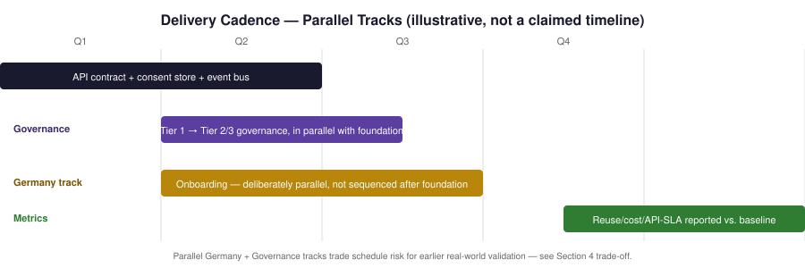

# ICB Trust Platform
### A Shared Customer Data, Communications & Content Platform for International Consumer Bank
**Platform Product Manager (VP) — Illustrative Product Strategy PoC**

*Prepared as an application artifact for JPMC's Platform Product Manager (VP), International Consumer Bank Digital team. Grounded entirely in public sources ([research notes](01_research_notes.md)) — no claim to insider knowledge of JPMC's actual systems, vendors, or roadmap. Full working detail in [v2 strategy doc](03_platform_strategy_prd_v2.md); this is the VP-brevity read (~2–3 min).*

---

## Executive Summary

ICB is scaling a branchless, fully digital retail bank across multiple countries (UK live, Germany targeted 2026). Each new market likely rebuilds the same customer data, communications, and content capability from scratch — a reasonable inference from ICB's public roadmap, not a confirmed fact. Meanwhile, the Fed's April 2026 SR 26-2 guidance explicitly left generative and agentic AI outside formal model-risk scope for banks over $30B in assets, so any AI-adjacent feature a market adds today has no standard governance path to plug into.

**Proposal**: a shared platform — API contract, integration layer, governance service — that any ICB market consumes instead of rebuilding, with AI governance as one capability it exposes, not its reason for existing.

*ICB's multi-market expansion needs a shared platform for customer data, communications, and content — durable on its own merits, but designed so a governed AI capability is a configuration, not a re-architecture.*

## 1. Who This Serves

| Stakeholder | Need |
|---|---|
| Market launch team | Reusable integration, not a rebuild |
| Risk & Compliance | Standard, auditable AI review path |
| Legal | Local privacy law interpretation — hard gate per market |

*(Full 7-row RACI including Vendor Management, Engineering, and CCB/ICB leadership in the [v2 doc](03_platform_strategy_prd_v2.md), Section 2.)*

## 2. Architecture — Three Decisions That Matter

1. **Sync only where staleness is dangerous.** Consent state is written synchronously to a single store before any comms send — the one deliberate exception to an otherwise async, event-driven design. Sending to an opted-out customer is the actual compliance risk; everything else can tolerate eventual consistency.
2. **Version the platform's own API, not the vendor's.** A CDP or comms vendor swap happens behind the platform's contract, invisible to market teams — this is what makes "buy the components, build the governance layer" a real technical strategy instead of a slogan.
3. **AI governance is a callable service, not the platform's core.** Market teams call a Governance & Policy Engine for a risk tier (Tier 1 automated / Tier 2 spot-checked / Tier 3 full human-in-the-loop) — same integration discipline as any other platform service.

## 3. Roadmap — RICE-Prioritized

RICE = (Reach × Impact × Confidence) ÷ Effort. Reach = markets/features touched per year; Impact = 3 (massive) to 0.5 (low); Confidence = %; Effort = person-months.

| # | Initiative | Reach | Impact | Confidence | Effort | RICE | Sequencing note |
|---|---|---|---|---|---|---|---|
| 1 | Platform API + consent store + event bus (foundation) | 3 | 3 | 80% | 6 | **1.2** | Architectural prerequisite — ships regardless of RICE rank |
| 2 | Governance tiering, Tier 1 automated | 10 | 2 | 70% | 3 | **4.7** | Highest RICE — fast, high-reach. Ships *in parallel* with foundation, not after |
| 3 | First market onboarding (Germany, per public 2026 timeline) | 1 | 3 | 60% | 4 | **0.45** | Lowest RICE, but the flagship proof point — see trade-off below |
| 4 | Tier 2/3 governance + reuse/cost metrics live | 3 | 2 | 65% | 5 | **0.78** | Depends on 1 and 2 landing first |

**Trade-off, stated explicitly**: pure RICE would deprioritize Germany onboarding. But it's the only item with direct executive visibility and the only real-world validation of the whole thesis. **Recommendation: run it in parallel with the foundation build**, accepting schedule risk on purpose rather than letting a scoring model quietly bury the highest-visibility bet.

## 4. Delivery Cadence *(illustrative sequencing, not a claimed timeline)*

| Quarter | Milestone | Gate |
|---|---|---|
| Q1 | API contract + consent store design | Architecture review with Eng |
| Q2 | Governance Tier 1 live, parallel to foundation build | Risk & Compliance sign-off |
| Q3 | Germany onboarding (parallel track, per Section 3 trade-off) | Market GM + Legal sign-off |
| Q4 | Tier 2/3 live; reuse/cost metrics reported against baseline | CCB/ICB leadership roadmap review |

## 5. Success Metrics — Platform, Not Feature

| Metric | Why it's a platform metric |
|---|---|
| Reuse rate | % of a new market's integration need met by the platform vs. custom code |
| Time-to-integrate a new market | End-to-end, kickoff to first live send/sync |
| API SLA adherence | Platform's own contract uptime, independent of underlying vendor |
| Cost-per-market-onboarded | Should trend down as the platform matures — the actual leverage thesis |
| Governance review cycle time (by tier) | Proves the governance service is fast enough to not become shadow-IT bait |

## 6. Risks

- **SR 26-2's AI exclusion could be revised** — governance model proposed to be reviewed semi-annually, not treated as permanent. Exactly why the thesis doesn't lean on it as sole justification.
- **CFPB Section 1033 is enjoined/under reconsideration** — data layer built flexible to open-banking requirements without assuming the rule's final form.
- **Privacy law varies by market** (GLBA/US state law vs. UK/Germany) — Legal is a hard gate per market, not a formality.

## 7. What I Don't Know

- Chase's actual CDP/CMS/comms vendor stack — Section 2's "version your own API" pattern is designed to make this low-risk to be wrong about.
- Whether an internal AI governance framework already exists beyond the general framing publicly reported for LLM Suite (JPMC's firm-wide internal gen-AI platform) — this platform would align with it, not duplicate it.
- Real Germany launch readiness — Section 4's Q3 milestone is illustrative against the public "targeted 2026" statement.

---
*Appendix: full architecture detail, extended metrics rationale, 7-row stakeholder map, and vendor management approach in [03_platform_strategy_prd_v2.md](03_platform_strategy_prd_v2.md). All source claims verified in [01_research_notes.md](01_research_notes.md).*
